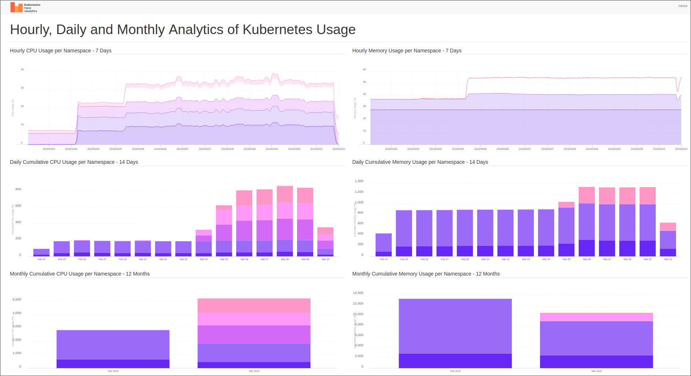

## Quick Tour for Impatients
Are you impatient and do first want to see Kubernetes Opex Analytics in action before reading more this README?

* [Take a look at the online demo](http://kube-opex-analytics.realopinsight.com:5483)

The demo is live over an actual small Kubernetes cluster running in GKE. 

It should display charts as follows, each of the charts enables tooltips showing details on resource usage over time. 




## What is Kubernetes Opex Analytics
Kubernetes Opex Analytics provides short-, mid- and long-term resource usage dashboards over Kubernetes clusters so to allow organizations to understand how their Kubernetes operating costs are spending by their different projects. The final **goal being to help them make cost sharing and capacity planning decisions** with factual analytics. 

To meet this goal, Kubernetes Opex Analytics collects CPU and memory usage metrics from Kubernetes's metrics APIs, processes and consolidate them over time to produce resource usage analytics on the basis of namespaces and with different time aggregation perspectives that cover up to a year. These perspectives also show a special usage item labelled _non-allocatable_ highlighting the **share of non-allocatable capacity** for both CPU and memory.

Its current features cover the following analytics:

* **One-week CPU and Memory Usage Trends** as consolidated hourly usage per namespace and globally for a cluster over the last 7 days.
* **Two-weeks Daily CPU and Memory Usage** per namespace as cumulative hourly usage for each namespace during each day of the last 14 ones.
* **One-year Monthly CPU and Memory Usage** per namespace as cumulative daily usage for each namespace during each month of the last 12 ones.
* **Last Nodes' Occupation by Pods** providing for each node the share of resources used active pods on the node.

You can see some screenshorts of the resulting analytics charts hereafter.

### Last Week Hourly Resource Usage Trends


### Two-weeks Daily CPU and Memory Usage


### One-year Monthly CPU and Memory Usage


### Last Nodes' Occupation by Pods


## Getting Started

### Get Kubernetes API Endpoint
Here we'll use a proxy connection to Kubernetes API

```
$ kubetcl proxy
```

This will open a proxied API access at `http://127.0.0.1:8001`.

### Start Kubernetes Opex Analytics
Kubernetes Opex Analytics is released as a Docker image. So you can quickly start an instance of the service by running the following command:

```
$ docker run -d \
        --net="host" \
        --name 'kube-opex-analytics' \
        -v /var/lib/kube-opex-analytics:/data \
        -e KOA_DB_LOCATION=/data/db \
        -e KOA_K8S_API_ENDPOINT=http://127.0.0.1:8001 \
        rchakode/kube-opex-analytics
```

In this command:

 * We provide a local path `/var/lib/kube-opex-analytics` as data volume for the container. That's where Kubernetes Opex Analytics will store its internal analytics data. You can change the local path to another location, but you MUST take care to adapt the `KOA_DB_LOCATION` environment variable accordingly.
 * The environment variable `KOA_DB_LOCATION` points to the path to use by Kubernetes Opex Analytics to store its internal data. You can remark that this directory belongs to the data volume atached to the container.
 * The environment variable `KOA_K8S_API_ENDPOINT` set the address of the Kubernetes API endpoint.
 
 >
 You should wait almost a hour to have all charts filled. This is a normal operations of Kubernetes Opex Analytics. 

## What's Next
Kubernetes Opex Analytics is a currently at a ealy stage but is already useful and ready to use. We encourage feedback and promise to be proactive to handle any troubles you may encounter when using it.

Meanwhile we already have some ideas of improvments for next releases:

* Add support for multiple Kubernetes clusters. 
* Add exporters for charts to provide the ability to use the generated charts for reports or documentation for your audiences.
* Add exporters to push analytics generated by Kubernetes Opex Analytics to third-party timeseries databases such as InfluxDB, Graphique or ElasticSearch, so that they can be visualized using external systems such as Grafana and Kibana.
* Add exporters to provide CSV data so that the resulting analytics data can be used to produce other custom analytics.
* Add Grafana dashboard templates so to unify the integration with existing monitoring and visualization stacks within organizations. 
* Other ideas are welcomed, please open an issue to submit your idea if you have any one.

## License & Copyrights
This tool (code and documentation) is licensed under the terms of Apache License 2.0. Read the `LICENSE` file for more details on the license terms.

The tool includes and is bound to third-party libraries provided with their owns licenses and copyrights. Read the `NOTICE` file for additional information.

## Contributions
Contributions are accepted subject that the code and documentation be released under the terms of Apache License 2.0.

To contribute bug patches or new features, you can use the Github Pull Request model. 
